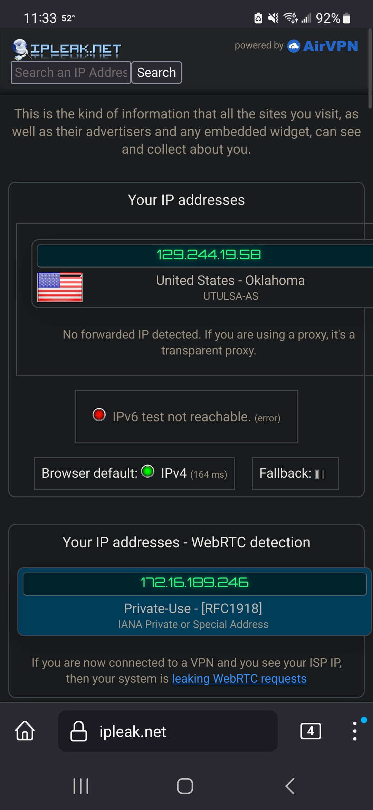
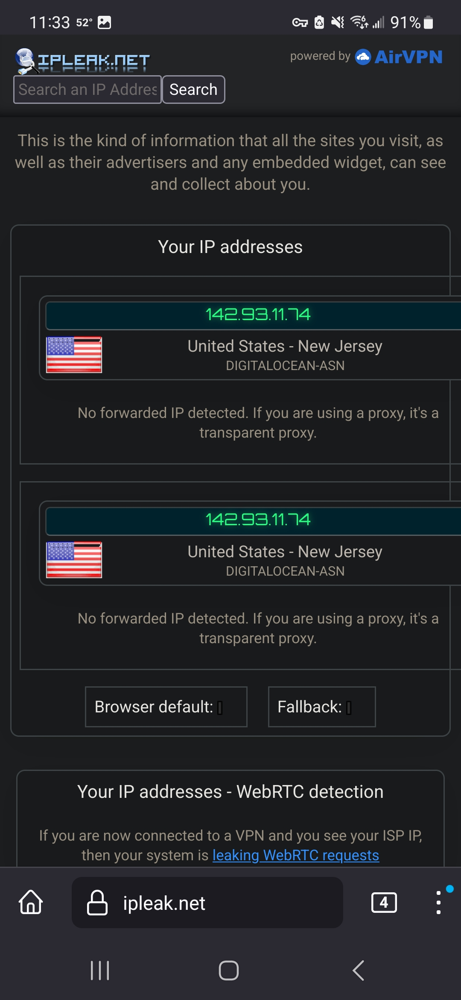
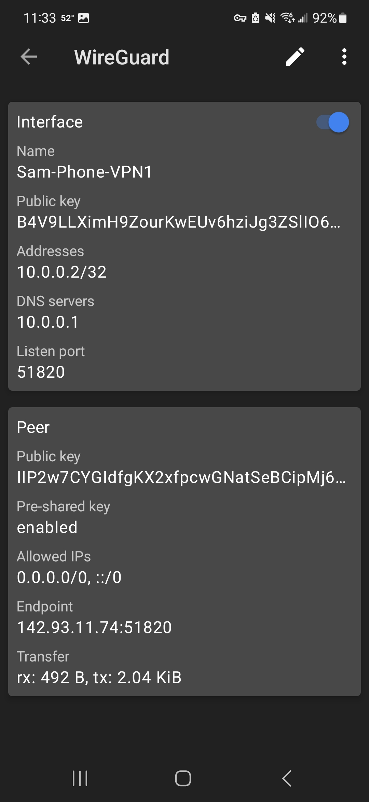
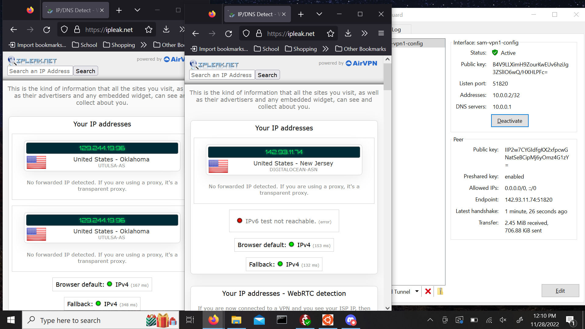

# wireguard.github.io
# Samuel Lipscomb
# Sys Admin
# 11/28/22
# Sam's Installation Guide for Wireguard Using Docker

Welcome back. Today I will be detailing my installation of the Wireguard VPN using Docker. Fortunately, I have already completed most of these steps, since I had to set up my own VPN using Wireguard for another class. Nevertheless, I will now subject you to an incredibly boring yet informative guide on how to install Wireguard using Docker. From here on out it's Sam's way, or the highway.

1. First, I made an account on DigitalOcean using a special url that gave me $200 of credit for 2 months. This is great because I am poor.

2. I then created an Ubuntu droplet on the cheapest price plan, $4 a month, which, again, is great because I am poor.

3. After my droplet was set up (I chose to password protect it to avoid the hassle of SSH) I moved onto setting up Wireguard.
  
  a. I already had Docker and Docker Compose installed on my WSL so I didn't need to set any of that up this time around. I did run into some trouble using Docker Compose, but I was able to fix it by using the command "sudo chmod +x /usr/local/bin/docker-compose", which I got from https://thematrix.dev/install-docker-and-docker-compose-on-ubuntu-20-04/. I don't know why I had to fix the permissions again but it's fixed now so it's good I guess?
  
4. Setting up Wireguard was relatively easy. I just had to create the /wireguard/config folder and edit the .yml file, then copy and paste the following snippet of code from https://thematrix.dev/setup-wireguard-vpn-server-with-docker/:
  
version: '3.8'
services:
  wireguard:
    container_name: wireguard
    image: linuxserver/wireguard
    environment:
      - PUID=1000
      - PGID=1000
      - TZ=Asia/Hong_Kong
      - SERVERURL=1.2.3.4
      - SERVERPORT=51820
      - PEERS=pc1,pc2,phone1
      - PEERDNS=auto
      - INTERNAL_SUBNET=10.0.0.0
    ports:
      - 51820:51820/udp
    volumes:
      - type: bind
        source: ./config/
        target: /config/
      - type: bind
        source: /lib/modules
        target: /lib/modules
    restart: always
    cap_add:
      - NET_ADMIN
      - SYS_MODULE
    sysctls:
      - net.ipv4.conf.all.src_valid_mark=1

5. I then tweaked some values in the config. First, I changed the timezone from Asia/Hong_Kong to America/Detroit since Detroit is also on Central Time. I also changed the serverurl to the one on my DigitalOcean dashboard (10.116.0.2), and created a two config files for my desktop and phone.

6. After that all I had to do was start Wireguard with the command "docker-compose up -d" and I was good to go.

7. The final parts of the assignment were straight forward. I downloaded the Wireguard app on my phone and scanned the QR code off of WSL to connect to my VPN. The screenshots showing my IP without the VPN on, my IP with the VPN on, and the VPN interface itself are shown below. I apologize beforehand, these screenshots are massive and difficult to format.

8. All I needed to do now was document it running on my laptop. Huzzah! My Wireguard VPN is complete!

